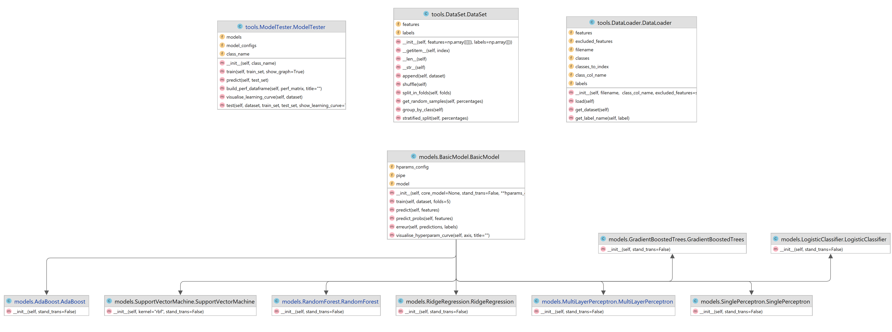

## Setup 
La version Python 3.8+ est fortement recommendé.

Pour installer toutes les dépendeances du projet :
```
pip install -r requirements.txt
```

Notre analyse se base sur le notebook Jupyter `workspace.ipynb`.

## Diagramme UML


## Le package tools
- La classe **DataSet** : contient un ensemble du données (matrice des attributs et leur label respectif). Cette classe fournit beaucoup de fonctions utilitaires qui nous permettent d'ajouter des données, mélanger les données déjà contenues dans la classe, diviser les données en K partitions, récupérer des échantillons aléatoires des données en respectant des proportions, grouper les données par leur classe et les diviser en plusieurs parties d'une manière stratifiée.
- La classe **DataLoader** : aide à charger un fichier CSV et encodent tous les labels par des valeurs numériques. Il peut nous donner le dataset du fichier chargé mais il faut le consulter pour savoir le nom du label.
- Le module **Metrics** : contient des fonctions utilitaires pour le calcul de la matrice de confusion et les métriques d'évaluation de performance.
- La classe **ModelTester** : une classe utilitaire qui charge dynamiquement un modèle et applique toutes ces configurations possibles. Cette classe nous fournit les fonctions d'entraînement et de prédiction qui permettent de tester toutes les configurations possibles(Par exemple les choix de fonctions d'activation, de solver, de taille du modèle, des conditions d'arrêt, etc.) d'un modèle avec un seul appel de fonction. En plus, ces fonctions retourne un DataFrame Panda qui contient toutes les mesures de performance. Il est possible que ces fonctions nous affichent des graphes qui détaillent le processus de l'entraînement comme la recherche d'hyper-paramètres et la courbe d'apprentissage (learning curve).

## Le package models
- La classe **BasicModel** : une classe de base qui contient toutes les fonctionnalités communes entre tous les modèles. Si la standardisation est spécifiée, une phase de standardisation est ajouté à la pipeline de traitement. Si des configurations d'hyper-paramètres sont spécifiés, une étape de recherche d'hyper-paramètres sera ajouté à l'aide de la classe GridSearchCV de Sickit-Learn avec une validation croisée aléatoire et stratifiée de 5 partitions. Une fonction predict_proba est également fournie pour nous retourner les probabilités d'appartenances ainsi que les classes dans le cas où le modèle de base le permet. Cette fonction nous permet de calculer l'entropie croisée (log loss) ainsi que le ROC AUC.
- La classe **LogisticClassifier** : une classe qui hérite de BasicModel et qui implémente la classification en utilisant la régression logistique.
- La classe **RidgeRegression** : une classe qui hérite de BasicModel et qui utilise le classifieur de Ridge.
- La classe **SinglePerceptron** : une classe qui hérite de BasicModel et qui utilise le Perceptron comme un classifieur de base.
- La classe **SupportVectorMachine** : une classe qui hérite de BasicModel et qui utilise la machine à vecteur de support (SVM) comme un classifieur de base le noyau par défaut est RBF.
- La classe **MultiLayerPerceptron** : une classe qui hérite de BasicModel et qui utilise un réseau de Perceptron comme un classifieur de base.
- La classe **RandomForest** : une classe qui hérite de BasicModel et qui utilise les forêts d'arbres décisionnels comme un classifieur de base.
- La classe **AdaBoost** : une classe qui hérite de BasicModel et qui utilise le classifieur Adapatative Boosting comme classifieur de base.
- La classe **GradientBoostedTrees** :  une classe qui hérite de BasicModel et qui utilise le classifieur GradientBoostedTrees comme classifieur de base.